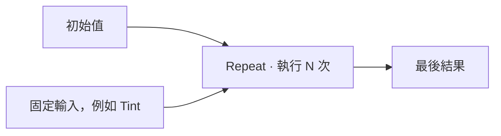

# TD-Sgrape 迴圈：討論提案

## 2026-09-20 補充：Loop 子圖、控制出口與函式邊界

狀態：使用者要求先記錄，回到[來源整理及 MAT Attribute](SOURCE_ARCHITECTURE_REVIEW.md)。以下是後續設計方向，沒有實作 Loop 或改動現有 Function；細節未定項不作為已完成的規格。

- 優先研究具有明確範圍的 Loop 子圖，外部接收 N、初始值及其他資料，內部描述一輪運算；不從任意回接推測迴圈邊界。
- 入口／出口節點可以定義資料介面，Loop 提供索引與控制接口。是否以兩層 UI 呈現、具體節點排版仍未決定。
- 逐輪值、外部不隨迭代更新的輸入、索引各有角色。外部可引用最終結果；此處不是跨影格 feedback。
- 計次規則可採 `i = 0; i < N; ++i`；索引起點／步長等以子圖運算換算，不直接開放任意 for 判斷式。規則固定不代表 N 必須由編輯器求出常數。
- 使用者明確補充可以用 bool 控制 Break／Discard，因此不能把「完全沒有提前終止」當成已同意的限制。停止條件可由本輪圖計算，交給 Loop 控制接口決定是否結束。
- `T state = initial` 是示意碼，T 代表實際型別；目前值從初始值開始，每輪更新。零次回傳初始值、負數 N 的處理是已提出的規則候選，尚未逐項定案。
- 停止條件在本輪前／後檢查、為 true 時採用本輪新值或上一輪值、多個逐輪值的更新順序、巢狀停止目標都需明確定義；還不能因只接一個 bool 就視為全部決定。

### 子圖不是天然的 GLSL 函式

一般子圖表達封裝與輸入／輸出；Loop 子圖表達迭代範圍；GLSL 函式定義呼叫與 return 的目標。子圖輸出不等於立即 return，不能因產碼改成 inline／helper function 而改變控制行為。

- Break 要在所屬迴圈區塊產生；輔助函式不能用 break 跳出呼叫端的迴圈。bool 條件計算與實際控制指令分開處理。
- Discard 限 Fragment／Pixel，終止目前片段處理，不只退出子圖；Return 離開所在函式，放入 main 時會離開 main。
- 控制節點即使沒有數值出口，也不能被當成未使用的純數值運算而移除。執行位置與作用域需要產碼器的明確規則。
- 產生 GLSL 控制區塊，不在 JavaScript／Python 執行每輪或為顯示資訊模擬 Shader。不承諾合法迴圈一定快速或終止。

語言依據：[GLSL 4.60 Statements and Structure](https://registry.khronos.org/OpenGL/specs/gl/GLSLangSpec.4.60.html#statements-and-structure)。GLSL 本身沒有 goto。

### 自訂碼與診斷

自訂節點／程式碼可宣告合法接口，但內部仍可能到宿主編譯時才發現錯誤。圖檢查接口，自訂內容由作者負責，產碼包裝與失敗處理由工具負責；不能把工具錯誤歸給作者。

使用者希望把診斷對應回節點，以紅色圓圈叉號提示，並提供自訂碼行號。保留草稿供修正，保留最後成功 Shader；「回到節點」是定位診斷，不是自動撤銷作者程式碼。細節與現有診斷機制整合待後續設計，不宣稱本輪已完成。

### 與早期提案的關係

下文完整保留 2026-09-09 的研究背景。其中「目前沒有 int／bool」「Iterations 只允許參數」「初期不提供提前終止」及「Loop Body 等同共用 Function」不是本輪定案；不能直接用作現在的能力限制。Function 共用／本地化等歷史提案也需等控制語意確定後重新檢視。

## 2026-09-09 歷史提案

2026-09-09。依里程碑第五項產出；**只有研究與設計，0.2.2 沒有加入迴圈功能。** 以下「建議」尚未成為產品承諾或定案。

建議從一個 **Repeat 節點＋可共用的 Function** 開始。使用者指定重複次數，雙擊進入 Function 編輯每一步；前一步的結果是下一步的輸入。保留現有 Function 的共用、首次修改才本地化及 Make Independent 行為，降低需要重新學習的操作。

## 從使用者想做的效果出發

| 效果 | 需要的能力 | 建議順序 |
| --- | --- | --- |
| 對座標或數值重複變形，疊加數層程序效果 | 固定次數、每次傳遞數值、可取得目前次數索引 | 第一個可驗證範圍 |
| 多次取樣後累加顏色，如小型模糊核 | 同時傳遞顏色累計與取樣座標／索引；明確的貼圖取樣規則 | 固定次數驗證後 |
| Ray marching、到達條件就停止 | 每個像素可能有不同次數、提前終止、最大次數 | 後續擴充，不能只多放一個 while |
| 前一幀畫面影響下一幀、粒子持續模擬 | 跨幀狀態、重設及資源讀寫安排 | Sgrape TOP／POP／Compute 後期議題 |

這些是候選使用案例，尚未代替使用者決定最先需要哪個效果。

## 圖中的行為

外層仍是平常的單向連線。Repeat 像 Function Call 一樣接收初始數值、顯示最後結果，選取後右側 Parameter 顯示 Body Function、Iterations 和資料對應。

雙擊 Repeat 進入被引用的 Function；Graph 路徑顯示目前 Function，TD component 路徑保持不變。建議在導航旁加上「作為 Repeat Body 編輯」的提示，說明這份 Function 可能也有一般 Call。這延續現有兩種路徑的分工。

同一個 Function 可以被一般 Call 執行一次，也可以被不同 Repeat 執行不同次數。**次數與資料對應放在 Repeat 調用節點上**；Function 定義只描述一步做什麼。

假設 Function 每次計算 `value × factor`：初始 value = 1、factor = 0.5，執行三次得到 0.5 → 0.25 → 0.125。factor 每次相同，value 每次接收前一步結果。這是本提案的數學例子，尚未新增到編輯器。

Blender 5.0 的 Shader Repeat Zone 使用成對邊界及重複區域，提供迭代索引與狀態傳遞；其 Cycles 與 EEVEE 對動態次數的限制不同。可參考它如何說明邊界與資料，但 TD-Sgrape 採 Function 入口是為了配合本專案已有的編輯模型。[Blender 5.0 Repeat Zone](https://docs.blender.org/manual/en/5.0/render/shader_nodes/utilities/repeat.html)

## 三種資料必須說清楚

| 資料 | 使用者看到什麼 | 規則提案 |
| --- | --- | --- |
| Carry／逐次傳遞值 | 例如 Value、Color、Position | 初始值進入第一次，每次 Function 的指定 Output 傳到下一次同型別 Input |
| Fixed Inputs／固定輸入 | 例如 Factor、Radius、Tint | 對同一次 Shader 執行而言，每一輪讀相同輸入；下一幀可隨 Uniform 變化 |
| Iteration／索引 | 0、1、2…… | 由 Repeat 提供，只有 Body 能取得當次索引；不是 TD 的 frame |

多個 Carry 需要**同時更新**：本輪所有 Output 都讀取本輪開始時的那組 Input，再一起成為下一輪 Input，避免依連接埠順序產生不同結果。例如交換 X 與 Y 不能先覆寫 X 再計算 Y。

建議初期支援目前已有的 float、vec2、vec3、vec4；Carry 對應要求完全相同型別，不在每一轮默默轉型。Iterations 先是可填寫的非負整數設定，不接受任意圖輸入；0 次明確回傳初始 Carry。Function 其他需要逐次累積的 Output 必須明確列為 Carry；一般 Fixed Inputs 不在迴圈內改寫。

目前圖沒有 int／bool 型別。若要讓既有數學節點使用索引，初期可用 float 插口提供整數索引，Help 明寫「以 float 提供的零起算索引」，內部控制仍用整數。這是相容性建議；另一方案是先正式增加 int 型別、插口顏色、驗證和轉換節點，成本較高。不能只在 GLSL 裡加入 int，卻讓圖上的型別規則失真。

## 與 Function 共用規則相容

- 從 Sgrape Library／Personal Library 選 Body，先唯讀引用；只看內容或調整 Repeat 次數不建立本地副本。
- 首次修改 Body 的內容，依目前規則在這個 Shader 本地化；此 Shader 引用同一來源版本的所有相關 Call／Repeat 一起切換。其他 Shader 和來源庫不變。
- 複製 Repeat 節點仍引用同一份 Function，但可各自設定次數與初始值。
- Make Independent 只為所選調用建立獨立 Function；之後編修不影響原本共用者。
- 巢狀唯讀 Function 的本地化仍需處理受影響的唯讀呼叫者，沿用目前原則，避免間接回寫來源。

Function 被多少次呼叫與每次使用什麼參數是不同事情。Repeat 不需在個人库製造「同一 Function 的 4 次版、8 次版」等重複項目。

## 編譯器需要先補的結構

目前 `sgrape_core.py` 會展開 Function，檢查圖的循環及 Function 循環參照，再輸出一次性的 GLSL 敘述；`sgrape_runtime.py` 指定 GLSL 4.50。已有限制包括每圖 256 節點、每 Shader 64 個 Function 定義、展開後每 Stage 2048 節點。這些是現有程式的限制，不是 GLSL 或 GPU 的標準上限。

GLSL 4.50 支援 for／while／do，禁止 Function 遞迴；長時間或不終止迴圈的後果取決於平台。語言允許迴圈，不表示把現有循環連線放行就能正確編譯。[Khronos GLSL 4.50，6.1.1、6.3](https://registry.khronos.org/OpenGL/specs/gl/GLSLangSpec.4.50.pdf)

建議引入明確的「迴圈區塊」編譯表示：初始化、Body、下一輪資料與最後輸出。一般連線及 Function 呼叫圖繼續禁止循環，迴圈僅由 Repeat 的結構表達。Body 的敘述必須留在區塊內，不能被目前平面展開提到外面只計算一次。

| 產碼方式 | 優點 | 代價與建議 |
| --- | --- | --- |
| 為每一輪複製整個子圖 | 可以較快沿用既有展開機制 | 次數乘上節點量，巢狀時放大；不建議當長期架構 |
| 輸出有上限的 GLSL for 區塊 | 程式碼規模較可控，也較適合未來增加動態次數 | 需要區塊作用域、Carry 與錯誤來源對應；建議方向 |

固定次數不等於必須由 TD-Sgrape 手動展開。驅動程式仍可能重新最佳化 for；不承諾一定保留迴圈或一定更快。也不必為此先把所有現有 Function 改成真正的 GLSL 函式。

Body 的錯誤應對應到「哪個 Shader／哪個 Repeat／哪個 Function／哪個節點」，而非只給最後產碼的行號。需要把新資料納入語意 hash、來源版本、本地化、Make Independent、存檔與舊格式相容規則。

## 動態次數、貼圖與性能

建議第一階段固定次數且不提供提前終止。之後如有實際需要，再分別評估由 Uniform 驅動的次數，以及每個像素不同的次數。兩者在使用者看起來都是可接線，但控制流程和負載並不相同。

非一致控制流程中的導數有未定義行為；隱含導數的貼圖取樣也受影響。因此動態 break 不能直接與現在的 Texture 2D 任意組合，將來需研究明確 LOD／gradient 或限制哪些組合可用。[Khronos GLSL 4.50，3.8.2、8.9、8.13](https://registry.khronos.org/OpenGL/specs/gl/GLSLangSpec.4.50.pdf)

固定次數本身也不保證安全：Body 內若有不一致的分支，仍需分析取樣的位置。Sampler 陣列的索引另有一致性要求，不能與普通數值 Carry 混為一談；TD 文件也特別指出 Uniform 整數與 MAT 的 Instance ID 在此不同。[Derivative：Write a GLSL TOP](https://derivative.ca/UserGuide/Write_a_GLSL_TOP)

粗略負載可以先理解成「執行 Shader 的次數 × 迴圈次數 × 每步成本」，但實際 GPU 時間還受取樣、分支、材質覆蓋範圍及硬體影響。Vertex 與 Pixel 的工作量也不同，應在目標 TD 場景量測；TD 官方最佳化文件區分了像素、頂點與其他瓶頸。[Derivative：Optimize](https://derivative.ca/UserGuide/Optimize)

提案中的保護措施：限制單層次數、巢狀層數和整體靜態展開／運算預算；過大的設定顯示原因，不能靜默裁切後輸出另一個效果。實際上限要經代表性 Body 測試決定，不把未量測的 64 或 256 次宣稱為通用安全值。初期可先不開放巢狀 Repeat，仍允許 Body 調用一般 Function。

本版已有的臨時候選能隔離無效程式及設定提交失敗，但候選和正式材質仍使用同一台 GPU。它不是長時間 GPU 工作的隔離容器；編譯成功也不是執行時間合格的證明。小解析度驗證不能代替正式場景的效能驗收。此點不改變 0.2.2 保留候選的已驗證結論。

Uniform 在每輪由 Shader 讀取，不需要在網頁與 TD 之間每輪同步。瀏覽器只編輯設定或顯示目前值；既有 Uniform 同步效能討論仍是另一項工作。

## 未來實作前的驗收清單

| 面向 | 要證明的結果 |
| --- | --- |
| 數值 | 0／1／多次結果正確；多個 Carry 同時更新；固定輸入不被誤改；索引從 0 開始 |
| 型別與作用域 | 拒絕 Carry 錯配、跨邊界直接連線及一般循環；Vertex／Pixel 限制通過巢狀 Function 傳遞 |
| 共用 | 同 Shader 共用 Body 即時反映；首次編修本地化；其他 Shader／來源庫保持原值；Make Independent 和複製行為正確 |
| TD | 以可算出結果的像素／幾何案例比對；失敗時最後成功材質和動態 Uniform 持續有效 |
| 效能 | 分開記錄編譯耗時與實際渲染成本；比較 0／1／小量／上限次數、數學／取樣 Body 及正式解析度 |
| UI 與保存 | Palette／Tab／拖線建立、Body 路徑、Parameter／Help 雙語；存檔、TOX 重載及 TOE 重開後引用一致 |

上述是未來驗收，不是本輪已執行的測試。本輪只閱讀現有程式與官方資料，沒有新增節點、修改圖格式或執行迴圈 Shader。

## 後續討論的三個決策

1. 第一個實際效果選重複數值／座標變形，還是多次貼圖取樣；建議先用能手算的數值案例建立正確性，再做使用者真正需要的效果。
2. 是否接受 Repeat 引用 Function、雙擊進入 Body 的主要操作；若希望直接看到區域內的所有節點，再評估 Blender 式成對邊界的顯示方式。
3. 首期固定次數是否足夠；如果一定需要 Ray marching 類提前終止，應把條件型別、取樣和效能限制一起規劃。

這些決策留到使用者方便討論時，不要求飛行期間回覆。端口策略、外部個人庫與新的 Shader 目標都未因本提案變更。
