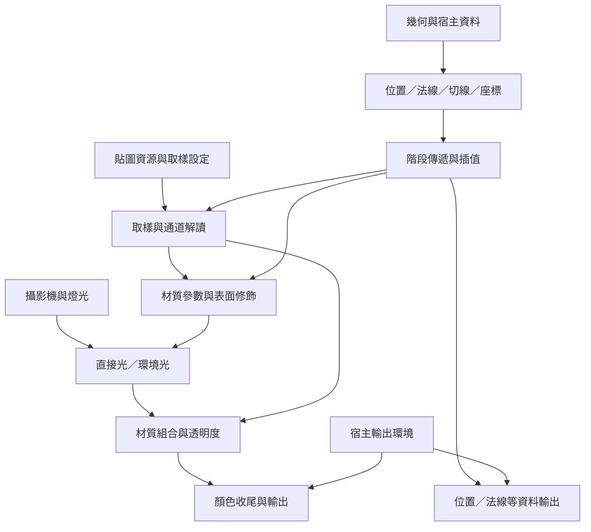

# 原生材質功能研究：從外觀需求到資料、運算與宿主責任

日期：2026-09-23。參考宿主：TouchDesigner 2025.32820。研究基準：TD-Grape 0.8.173，提交 `f6eb393`。

這份報告回答：**一個材質功能究竟要完成什麼，為此需要哪些資料、運算、階段傳遞與宿主能力？** 它供後續重構或新建專案理解問題，不要求沿用目前節點的拆法、產碼器的分支或 UI。

函數名稱與目前入口的逐項對照，見[原生函數清單](../features/MAT_NATIVE_FUNCTIONS.md)；舊案實作進度與驗收範圍，見[材質能力驗收表](../features/MAT_NATIVE_PARITY.md)。本報告不是完整 Phong／PBR 預置已交付的聲明。

關於目前 TD 版本與新版公開資料的差別，另見 [TouchDesigner 2025.32820 原生函數版本查核](TD_NATIVE_VERSION_REVIEW_2026-09-23.md)。該文區分宿主缺少能力與 Grape 尚未提供入口。

## 1. 結論與閱讀方式

**研究結論：材質能力不是函數清單的總和，而是資料取得、資料解釋、運算組合與輸出環境共同形成的行為。** 補齊函數入口是必要工作，但不能單獨證明功能已完成。

最適合保留下來的知識有三種：

1. **功能的依賴。** 例如法線貼圖需要幾何切線、正確的座標空間與 TBN；單有 RGB 取樣並不夠。
2. **組合的順序。** 例如 Phong 與 PBR 對透明度、顏色與光照的組合位置不同，不能一律移到最後乘上去。
3. **宿主提供的條件。** 例如貼圖綁定、幾何 Attribute、燈光、渲染目標與取樣狀態，不能從 GLSL 函數簽名完整還原。

本文標記的意義：

- **已確認／匯出碼：** 在指定版本的原生材質匯出內容中直接觀察到。文中的 E01 等編號對應附錄證據。
- **已確認／實測：** 已有特定場景的編譯或數值對照；結論限於該測試範圍。
- **推論：** 由依賴或公式推得的工程含義，尚非所有場景的實測結果。
- **建議：** 後續可採取的設計或驗證方式，不是新的架構裁定。

## 2. 研究範圍與證據強度

本次基礎是 158 個原生材質配置：Phong 85 個、PBR 73 個。每個配置匯出 Vertex／Pixel GLSL，檢查原生 MAT 與匯出的 GLSL MAT；這批配置全部連結成功。

配置包含預設、相容功能同時啟用、Toggle 的兩種狀態與選單的不同取值。四個 Phong 多重貼圖來源使用非空組合式；光照場景包含普通燈與環境燈。Common／Deform 頁不枚舉，Picking 不納入本輪完成範圍。

**這不是所有參數組合的窮舉，也不是 158 個完整畫面等價測試。** 相同選單的多個控制曾同步切換；某些功能會互相取代，例如 Phong 多重貼圖路徑與一般 Color Map 路徑。啟用一個參數，也不代表測試幾何或場景已使該分支真正生效。

目前已有燈光分量、Texture Attribute／實例座標及部分材質存取器的原生像素對照；完整預置、所有輔助輸出與所有宿主組合仍未完成。詳見驗收表中的測試紀錄。

## 3. 最上層的功能地圖

| 使用者想完成的功能 | 必要資料與操作 | 原生實現的主要依據 |
|---|---|---|
| 知道表面在哪裡、朝哪裡、從哪裡看 | 幾何位置、法線、變形、攝影機、座標空間轉換 | `TDPos`、`TDNormal`、`TDDeform`、`TDDeformNorm`、`uTDMats` |
| 將貼圖放到表面上 | 資源、座標來源、實例座標、取樣狀態、通道選擇 | `TDTexAttrib_名稱`、`TDInstanceTexCoord`、`texture` |
| 在不同階段使用資料 | Vertex 產生、Pixel 接收、插值或 flat 傳遞 | Vertex／Pixel 介面、camera／instance index |
| 改變表面凹凸或輪廓 | 法線重建、切線空間、高度取樣、視差或頂點位移 | `TDCreateTBNMatrix`、向量／矩陣運算、取樣與步進 |
| 決定表面如何反射光 | 材質參數、法線、視線、燈光、環境 | `TDLighting`、`TDLightingPBR`、`TDEnvLightingPBR` |
| 增加不完全由直接光決定的外觀 | Emission、Constant、Ambient、Rim、Darkness | 貼圖調制、加法、混合、視角與亮度運算 |
| 處理透明度與幾何／實例顏色 | Alpha、視角、貼圖、顏色乘法及其位置 | `TDSineLookup`、`TDColor`、`TDInstanceColor`、`TDPixelColor` |
| 輸出顏色或其他資料 | 輸出語意、Fog、Alpha Test、色彩空間、buffer | `TDFog`、`TDDither`、`TDAlphaTest`、`TDConvertColorSpace`、`TDOutputSwizzle` |

下面是依賴概覽，不是所有材質共用的一條固定執行順序：

## 4. 定位表面：幾何、攝影機與階段傳遞

### 4.1 同樣是向量，角色可能完全不同

**已確認／匯出碼，E01、E02：** Vertex 讀取位置與法線，經原生變形得到世界位置與世界法線；位置再經 `TDWorldToProj` 產生裁切空間位置。世界位置另傳給 Pixel，用於光照等運算。

因此至少要分清楚：

- 幾何原始位置、變形後的世界位置、最後寫入 `gl_Position` 的裁切空間位置。
- 點、方向與法線；它們即使都是三個分量，也不能隨意用同一種矩陣處理。
- 世界空間法線、攝影機空間法線、切線空間法線。

**推論：** 型別檢查通過並不能保證空間正確。例如世界空間的視線配上物件空間法線，仍是合法向量運算，但物件旋轉後光照會錯。這是驗證需要包含旋轉與非平凡變形的具體理由，不等於已決定把「空間」加入型別系統。

### 4.2 視線不是只有一個攝影機位置

**已確認／匯出碼，E01、E02：** 攝影機索引由 Vertex 取得並傳到 Pixel。Pixel 使用該攝影機逆矩陣中的位置減去世界位置，再正規化，形成 view 向量。

需要的是「這次繪製使用哪個攝影機」與「目前表面點在哪裡」的組合。只提供一個 Camera Position 節點，還不足以把完整流程接好。多攝影機實際畫面尚未在本批驗證。

### 4.3 階段介面本身就是功能

Vertex／Pixel 之間傳遞 UV、世界位置、法線或 TBN、顏色及索引。插值方式會改變結果；camera／instance index 使用 flat 整數傳遞，不能當作一般連續數值插值。插值後的法線也需要重新正規化。

原生投影路徑還傳入經 `TDInstanceTexCoord` 處理的 `TDUVUnwrapCoord`。因此「Common／Deform 設定留在原生參數頁」不表示圖可以略過原生變形與投影入口。

**建議：** 後續研究或重做時，把「取得資料」與「將資料送到另一個階段」分別驗證，不以畫面上出現一條連線作為成功標準。

## 5. 將資料貼到表面：資源、座標與取樣

### 5.1 一次貼圖取樣依賴四件事

1. 綁定的資源及其維度。
2. 座標從哪裡取得、使用哪個空間或層。
3. Filter、Extend、Mipmap、Anisotropy 等取樣設定。
4. 取到的分量如何被解讀。

`texture` 只顯示其中一部分。**已確認／既有實測：** 不相容的 TOP 綁定可能仍讓 Shader 連結成功，但 TD 發出警告且渲染為黑色。這說明「有 sampler 型別與取樣函數」不能取代資源綁定驗證，詳見材質驗收表。

同一份 GLSL 的 Filter 或 Extend 改變，也能造成不同外觀；這些狀態不能只靠比較 Shader 文字驗收。

### 5.2 SOP／POP 的座標取得

**已確認／匯出碼及既有實測：** `TDTexAttrib_名稱(layer)` 是具名座標存取入口。SOP 使用對應 UV 層；POP 需要對應名稱的 Attribute 與材質宣告。讀到的座標再經 `TDInstanceTexCoord`，最後送至 Pixel。

這是一條完整資料路徑：**幾何提供 → 宣告對應 → 指定層／名稱讀取 → 實例處理 → 階段傳遞 → 取樣。** 只補最後的 Texture Sample，不會修好前面讀錯來源的問題。

不同貼圖可以使用不同座標。稽核為減少配置數而同步切換某些控制，不表示材質設計應把所有貼圖強制綁在同一組座標。

### 5.3 螢幕座標與三平面不是同一種 UV 替換

**已確認／匯出碼，E04：** 螢幕模式直接在 Pixel 使用 `TDScreenSpaceCoord().st`，不需要先經過一般 Vertex UV 路徑。

**已確認／匯出碼，E03：** 此版本的三平面路徑在 Vertex 分別讀取 `TexX`、`TexY`、`TexZ`，各自套用實例座標並傳到 Pixel；Pixel 分別取樣，再以法線及 `TDTriplanarBlend` 合成。

因此不能把它描述成「只給一個世界位置，TD 就自動補好三個投影」。它還依賴三份幾何資料。[Phong MAT 官方說明](https://derivative.ca/UserGuide/Phong_MAT)將此模式限定於 POP，座標可由 Texture Map POP 產生。本批 SOP 測試的匯出與連結成功，只證明生成路徑可檢查，不證明三平面實際映射正確。

### 5.4 同樣的貼圖值有不同用途

高度、Alpha、Metallic、Roughness 等常使用單一通道，也可能選亮度、RGB 平均或 RGBA 平均。E09 的 RGBA 平均是四個分量等權平均；匯出碼中的 `luminance` 則是以 0.2126、0.7152、0.0722 加權 RGB 的局部函數。

這些是**資料解讀規則**，不是新貼圖種類。Phong 多重貼圖也主要是多次取樣再組合，例如本次配置的 `t0 * t1 + t2 * t3`；不能因為沒有額外 TD 函數名稱就漏掉這項能力。

## 6. 改變表面：法線、視差與位移

三者都可能使用貼圖，但改變的是不同東西。

| 功能 | 實際改變 | 不應混為一談的部分 |
|---|---|---|
| 法線貼圖 | 光照所使用的方向 | 沒有因此移動頂點 |
| 視差／視差遮蔽 | 取樣座標 | 沒有因此改變幾何輪廓 |
| 頂點位移 | 幾何位置與投影 | 效果受幾何細分程度影響 |

### 6.1 法線貼圖：取樣之外還有一個座標框架

**已確認／匯出碼，E01、E02：** Vertex 取得切線 Attribute `T`，處理法線與切線，將切線的第四分量作為方向手性資訊，呼叫 `TDCreateTBNMatrix`。Pixel 解碼法線貼圖，把 RGB 從以 0.5 為中心的表示轉成有正負的方向，對 XY 套用強度，再乘上 TBN 並正規化。

背面處理還涉及 `TDFrontFacing` 與法線方向調整。因此完整功能依賴：切線資料、變形後的方向、手性、跨階段矩陣、法線解碼、強度及正反面規則。

**具體反例：** 直接把法線貼圖 RGB 當成世界法線，程式可以編譯，但貼圖中的平坦法線不會隨表面方向正確轉動。這不是增加一個 `normalize` 就能修正。

### 6.2 普通視差：依高度與視角偏移座標

**已確認／匯出碼，E02：** 讀取高度通道，以 `1 - height` 處理；將 view 轉入切線空間，依高度、Scale 與 Bias 偏移貼圖座標。此版本匯出包含 Scale 乘以 0.04 與負半 Scale 的 Bias。

這些係數與通道方向是原生外觀的一部分。重做時若改成另一種常見視差公式，可能是合理的新功能，但不能據此宣稱與原生一致。

### 6.3 視差遮蔽：功能內部包含反覆取樣

**已確認／匯出碼，E05：** 原生流程沿切線空間 view 推進座標，反覆取樣高度並累積深度，到相交條件成立後，以前後兩步的結果修正最終座標。

它包含步進狀態、重複取樣、停止條件與末段插值。單次取樣節點及一般無環運算圖，不會自動具有這個流程。

**建議：** 後續可評估把固定的視差遮蔽算法做成具名能力，或提供能表達此流程的結構；這是待決選擇，並不代表必須先做通用迴圈編輯器。

特別注意：匯出碼的 32 層是步長的依據，並非明寫的最多 32 次迭代。若高度通道為 -1，`1 - height` 為 2，固定取樣結果下可需要約 64 次步進。不要把它紀錄成已具備硬性迭代上限；若後續要加上限或限制輸入範圍，需明列行為差異。

### 6.4 頂點位移：高度必須在 Vertex 可用

**已確認／匯出碼，E06：** 在原始位置沿法線加上 `Scale * (height - Midpoint)` 的位移，之後才經 `TDDeform` 與投影。

因此資源取樣、座標與通道選擇不能只存在於 Pixel。此匯出仍從原有幾何法線取得變形後法線，不能自行推定它同時根據高度導數重建了幾何法線。

**推論：** 相同高度圖用在低細分與高細分網格上會有不同輪廓。驗證應同時看幾何密度與位移結果，不能只比較貼圖是否讀得到。

## 7. 決定反射方式：Phong、PBR 與燈光遍歷

### 7.1 光照評估與完整材質是不同層次

光照函數接收法線、view、位置及材質參數，產生光照分量。完整材質還要取得與修飾這些輸入、遍歷燈光、組合結果並處理輸出。

**已確認／匯出碼：** 普通燈由 `TD_NUM_LIGHTS` 決定遍歷範圍；PBR 環境燈另由 `TD_NUM_ENV_LIGHTS` 遍歷。這是宿主場景資料，不是讓使用者手動填寫固定燈數。

目前全燈光節點已提供內部遍歷，使用者不需要建立 for。已有分量數值對照，但這不等於所有貼圖、透明度及收尾已正確組成完整材質。

### 7.2 Phong：多個反射分量分開控制

**已確認／匯出碼，E01：** `TDLighting` 產生 Diffuse、第一 Specular、第二 Specular。兩個 Specular 有各自的 Shininess，累加後再依材質顏色與貼圖組合。Ambient 另依 `uTDGeneral.ambientColor` 及材質設定加入。

只保留一個高光輸出，或讓兩個高光共用同一個 Shininess，都不能表示這份原生材質的所有能力。

Phong 的環境貼圖是另一條路徑：由 `reflect` 得到反射方向，再轉為球面或等距柱狀座標，取樣後乘環境顏色並加入結果。E07 的 `TDCubeMapToEquirectangular` 還提供 Mipmap Bias，不能只保留 UV 輸出。環境旋轉及所有資源維度的實際畫面尚待核對。

### 7.3 PBR：材質參數先改變光照輸入

**已確認／匯出碼，E02：**

- Specular Level 先乘以 0.08，並受對應貼圖調制。
- Metallic、Roughness、AO 由各自貼圖調制；Roughness 下限為 0.0001。
- Base Color 先經透明度、幾何／實例顏色與貼圖處理。
- Diffuse Color 由 Base Color 與 `1 - Metallic` 組成；Specular Color 在非金屬基準與 Base Color 之間依 Metallic 混合。
- `TDLightingPBR` 累加普通燈，`TDEnvLightingPBR` 累加環境燈；此匯出的環境光路徑使用 AO。

這份原生 PBR 匯出沒有額外加上舊整合節點使用的 `ambientColor * diffuse * AO`。因此不能只把函數名稱換成 PBR，其他組合保持不動。

**證據邊界：** 本報告確認呼叫的輸入、輸出及外圍組合，不根據名稱推定 TD 函數內部使用哪一版 BRDF、陰影算法或取樣策略；那些需要另查宿主實作或專門測試。

## 8. 補充外觀：發光、輪廓光與暗部

### 8.1 Emission、Constant、Ambient 要分開理解

**已確認／匯出碼，E01、E02：** Emission 可以受貼圖調制；Constant 是額外材質項；Phong Ambient 依場景環境光形成。它們在材質公式中的加入位置不完全相同，不能僅以「不用直接燈光」合併成一個來源。

尤其某個項目是否受 Alpha 或整體貼圖影響，要看整條公式的位置，不能只看參數名稱。

### 8.2 Rim：依視角建立的效果，不等於一盞燈

**已確認／匯出碼，E01、E02：** Rim 使用攝影機空間法線，計算相對視角、平面方向與寬度權重，可再用 Ramp、顏色貼圖及強度調制。平面方向長度為零時有保護處理。

這條路徑不需要遍歷一盞 Rim Light COMP。它是由表面朝向形成的材質效果；若之後把它展示為高階節點，內部仍需要清楚描述座標空間、權重與零長度處理。

本批檢查的是已匯出的 Rim 配置，沒有驗證所有額外 Rim 序列項的組合。

### 8.3 Darkness：依特定時點的亮度混合

**已確認／匯出碼，E01、E02：** Darkness 在 Fog 後以先前取得的 lightness 作為混合依據。Phong 的該亮度還是在環境貼圖貢獻加入前取得。

這不是「先算最終顏色，再檢查有多暗」的同義式。移動亮度計算位置就會改變結果；匯出路徑也不能一律假定該權重已限制在 0–1。為對齊原生行為，不應自行增加 Clamp。

## 9. 透明度、點色與實例色：順序會改變結果

### 9.1 固定 Alpha 與視角 Alpha

**已確認／匯出碼，E08：** 固定模式使用指定 Alpha 與貼圖；視角模式則由法線與 view 的關係，經 `TDSineLookup`、Rolloff 與前面／側面 Alpha 混合形成。Phong 還可依光照亮度調制 Alpha。

匯出碼中的 `getVaryingAlpha` 是局部組合函數，不是另一個 TD 原生函數。若僅列 TD 呼叫，會漏掉這整項功能。

### 9.2 Phong 與 PBR 沒有共用的「最後乘 Alpha」公式

**已確認／匯出碼，E01、E02：** Phong 對組合的光照顏色做 Alpha 預乘，再套用後續顏色調制；PBR 則在光照前處理 Base Color 的 Alpha 與顏色，讓結果參與 Diffuse／Specular 的建立，後面另加入其他材質項。

**具體反例：** 把 PBR 改成最後才將所有顏色乘 Alpha，會連後加的 Emission 一起改變，並且不能一般性地重現前面 Specular 混合的結果。因此一個共同的尾端乘法不能取代兩條原生公式。

### 9.3 關閉點色不代表關閉實例色

**已確認／匯出碼，E01、E11：** 一條路徑在 Vertex 讀 `TDColor`，經 `TDInstanceColor` 後傳入 Pixel，再經 `TDPixelColor`。停用點色的另一條路徑，仍傳遞 flat 的 Instance Index，於 Pixel 呼叫帶索引的 `TDInstanceColor`。

因此「不使用幾何點色」與「不使用實例色」不是同一個開關。畫面不對時，需核對是哪一層顏色被省略，不能把所有顏色乘法當成一個可任意刪除的步驟。

## 10. 輸出：顏色與資料不能只看 GLSL 型別

### 10.1 材質收尾有明確順序

**已確認／匯出碼，E01、E02 的完整著色路徑：** Pixel 入口使用 `TDCheckDiscard`。材質組合後可經 Fog、Darkness、Dither、Alpha Test、色彩空間轉換與 Output Swizzle，最後寫入目的地。

`TDConvertColorSpace` 依賴 `TDColorSpace` 引入與輸出環境。Render TOP 的對照通過，不代表 Window／MAT viewer 的目的地轉換已驗證。

**目前差異：** 舊案 Pixel Output 在取得輸入後才套用 Dither；把色彩空間轉換節點單純接在它前面，會得到轉換在 Dither 前的順序，與上述原生路徑不同。函數入口補齊後，仍須處理整合位置；本報告沒有因此修改既有輸出行為。

### 10.2 同為 vec4，也可能完全不是顏色

**已確認／匯出碼，E10：** 攝影機空間位置輸出由世界位置乘攝影機矩陣形成；此資料路徑不套用 `TDConvertColorSpace`，但仍使用宿主輸出 Swizzle。

**具體反例：** 位置分量 -2 或 4 是有效資料，不能因為目的地型別為 vec4，就先限制到 0–1 或做顯示色彩轉換。法線、位置、陰影等輔助輸出各有資料語意。

E12 的 Camera Depth to Alpha 又是另一種組合：以攝影機空間深度取代輸出的 Alpha。多個 Color Buffer 也需要各自指定內容與處理方式；不能把所有 buffer 當成同一張最終顏色的複製。

### 10.3 不屬於 Shader 運算圖的部分仍影響結果

深度、混合、剔除與骨骼變形設定依既有裁定留在原生參數頁。Shader 圖須正確使用相關宿主能力，Apply 也須保留設定；否則即使生成公式相同，畫面仍可能不同。

## 11. 對重構或新專案有價值的推論

以下是從原生功能歸納的需求，**不是候選 schema 的自動新增欄位，也不是沿用舊案實作的要求**。

| 需要能表達的事情 | 本研究中的具體理由 | 尚不能直接替作者決定的事 |
|---|---|---|
| 同一運算的不同階段／宿主條件 | 座標讀取、位移取樣、實例色有不同路徑 | 放在子集、來源表或具名能力的具體結構 |
| 多個結果與型別關係 | 光照分量、環境 UV 加 Bias、TBN | 一個高階節點或可組合節點的 UI 分法 |
| 明確資料依賴 | 法線貼圖依賴 T；三平面依賴三個座標 Attribute | 缺資料時拒絕、提示或採何種預設 |
| 非純數值的資源條件 | sampler 維度、取樣狀態、TOP 綁定 | 各種狀態由哪個介面編輯與保存 |
| 可見的組合與順序 | Alpha、Darkness、Dither、色彩空間 | 通用結構與少量明示例外的劃分 |
| 固定算法中的反覆操作 | 視差遮蔽、普通／環境燈遍歷 | 具名能力、子圖或流程結構的選擇 |
| 輸出的用途 | 顏色與位置同為 vec4，處理不同 | 用何種定義讓 UI 與產碼共同讀取 |

**建議：** 先用既有定義能力、子集與內容組合表達。只有表達不了，或表達後複雜度明顯不合理，才提出新增能力的候選，並附上本表中的具體案例與代價。不要因為要趕出預置，就把差異藏進產碼器依節點 ID 分派的分支。

UI 可以把這些資料投影成選單、文字建議或預置；顯示方式不應成為另一份決定 Shader 行為的權威。高階預置是否看起來像獨立節點，與它需要哪些底層能力，是可分開處理的問題。

WebGL 與 TD 可以分享普通數學與材質組合的知識；TD 幾何存取、燈光、變形及目的地處理不能只換函數名稱就視為移植完成。新環境須明確提供對應資料與行為，或公開不支援的範圍。這是功能對照工作，不是本報告已決定的方言架構。

## 12. 建議保留的最小驗證案例

這些是後續驗證設計，未全部執行。每個案例應同時記錄原生參數、幾何資料、資源狀態、匯出碼及畫面／數值結果。

| 案例 | 能揭露的具體缺口 |
|---|---|
| 同一模型旋轉，使用平坦及傾斜法線貼圖 | 座標空間混用、缺 TBN、法線方向錯誤 |
| SOP UV 與具名 POP 座標、改名後重跑 | 把固定 UV 與具名 Attribute 誤當同一入口 |
| 兩個不同顏色／座標的實例，切換點色 | 省略 Instance Index、實例色或實例座標 |
| 0／1／2 盞普通燈，另測環境燈 | 缺遍歷、漏分量、零燈錯誤預設 |
| Alpha 非 1，搭配 Emission 與 Metallic | Phong／PBR 組合位置錯誤 |
| 高度圖改變視角，再切換網格密度 | 混淆視差與真實位移、Vertex 取樣缺失 |
| 切換 Filter／Extend，同時保持 GLSL 不變 | 資源狀態沒有被保存或傳給宿主 |
| 輸出負值與大於 1 的位置資料 | 對資料輸出誤套 Clamp 或色彩轉換 |
| Render TOP 與 MAT viewer／Window 對照 | 目的地色彩處理差異 |
| 有效陰影、Fog、POP 三平面與多輸出場景 | 編譯通過但實際分支未生效的假驗證 |

## 13. 證據索引與重現方法

匯出入口：[audit_native_material_functions.py](../../tests/td/audit_native_material_functions.py)。每個案例記錄設定、兩階段 GLSL、SHA-256 與編譯結果；原始資料留在私人工作區，公開文件不依賴私人絕對路徑。

以下雜湊為稽核紀錄中 Shader 文字 SHA-256 的前 12 碼（UTF-8、LF 換行），用於辨識參考內容，不是新版本 TD 的固定輸出要求。Windows 寫出的 CRLF 檔案須先正規化換行，才會得到相同值。`enabled` 指本次配置的相容功能集合，不代表所有互斥功能同時存在。

| 證據 | 原生材質／案例名稱 | Vertex | Pixel |
|---|---|---|---|
| E01 | phong / enabled | `76904e38f040` | `85ccf6af8ec1` |
| E02 | pbr / enabled | `9164b2b61db9` | `6083639e4626` |
| E03 | phong / texturesamplingmode_triplanar | `96c91a4a9689` | `b858d777bde0` |
| E04 | phong / texturesamplingmode_screenspace | `5797e91f2765` | `7dd41f34c663` |
| E05 | phong / parallaxocclusion_1 | `76904e38f040` | `e408c132f181` |
| E06 | phong / displaceverts_1 | `9fd0514ccf41` | `49524aa3cdff` |
| E07 | phong / envmaptype2d_equirect | `76904e38f040` | `95ddaca934d5` |
| E08 | phong / alphamode_0 | `f58b2b606a26` | `a64e1b0695a5` |
| E09 | phong / heightmapchannelsource_average | `76904e38f040` | `c5330bf2ba07` |
| E10 | pbr / color0output_cameraspaceposition | `9164b2b61db9` | `b7fa93c18dc4` |
| E11 | phong / applypointcolor_0 | `1775c95a9e5c` | `9c312b775d15` |
| E12 | phong / writecameradepthtoalpha_1 | `76904e38f040` | `44261d5a2d89` |
| E13 | phong / frontfacelit_frontlit | `76904e38f040` | `85ccf6af8ec1` |

重現時使用相同宿主版本，建立稽核腳本所需的隔離場景，分批匯出與檢查。不要直接把原生輸出整批 Apply 到使用者工作中的材質。若版本、參數或場景不同，雜湊不同不等於功能錯誤；需回到對應功能比較。

本報告的主要依據是本機宿主匯出；補充參考為官方 [Phong MAT](https://derivative.ca/UserGuide/Phong_MAT) 與 [PBR MAT](https://derivative.ca/UserGuide/PBR_MAT) 說明。34 個 TD 呼叫名稱是字面名稱數，包含具名 Attribute 的不同拼寫及預處理分支，不代表 34 種獨立能力，也不包含 TD 函數內部的完整遞迴呼叫圖。

## 14. 特別標出的差異、限制與待決事項

依對驗收與後續決策的影響排列；以下不是要求現在擴大產品範圍。

1. **嚴重／已確認：函數齊全仍可能組合錯誤。** Alpha 與輸出收尾已有具體順序差異。若以「清單都打勾」封存，仍不能滿足原生材質功能等價；必須保留組合驗收。
2. **嚴重／已確認：編譯覆蓋不能冒充運行覆蓋。** 三平面需要 POP 資料，陰影需要有效陰影場景；本批連結成功不能證明這些結果。3D／Cube 資源、實例貼圖、多攝影機、額外 Rim／MRT 序列等也尚未完整驗證。
3. **次要／已確認：32 層不是明示的迴圈上限。** 視差遮蔽的負高度反例會增加步數。若增加上限，須明確記錄它與原生流程的差異；不在此報告擅自修改。
4. **次要／待核對：官方文字與觀察到的 Constant 組合位置不同。** Phong 官方說明將 Constant 描述為不受紋理與 Alpha 影響；E01 路徑卻把它放入後續受預乘與貼圖調制的組合中。此處只登錄差異，不判定是文件簡化、版本差異或宿主其他處理；需用隔離場景比較原生像素。
5. **次要／已確認：不同參數可能匯出相同 GLSL。** E13 與 E01 的兩階段雜湊相同。不能因此宣稱 Front／Back 設定無效，或編譯器漏實作；差異可能仍在宿主參數、引入內容或渲染狀態中，須另外追蹤。
6. **建議／推論：新專案應承接功能證據，不承接舊案的分支安排。** 這份報告證明哪些資料與組合必須存在，不證明目前節點邊界最合理。是否新增欄位、能力或例外，仍需對照新專案已裁定的結構，由作者審查。
